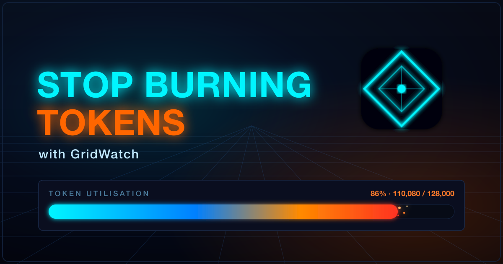

# Stop Burning Tokens with GridWatch

📅 June 6, 2026 • ⏱️ 7 min read • `gridwatch` `copilot` `tokens` `cli`

## The 128K wall nobody warns you about

Here's something that took me longer to learn than I'd like to admit: Copilot CLI has a 128,000 token context window, and you start paying for it long before you ever type a prompt.

Every skill you've enabled, every MCP server you've installed — they all quietly load into that window first. Then your conversation history piles on top. By the time you're halfway through a decent session, you're a lot closer to the edge than you think, and the first sign of trouble is usually a compaction kicking in and quietly eating half your plan.

I built GridWatch partly to stop flying blind on this. And here's the thing that took me a while to properly appreciate: most of the saving doesn't happen mid-session at all — it happens *before you even start a session*. So these days I do most of my token housekeeping up front, before I kick a session off. 

This is less a feature tour and more a write-up of how I actually use it to keep that starting position lean. None of this is rocket science — it's mostly just being able to *see* where the tokens are going.

## First, know where you stand — the session token bars

You can't optimise what you can't see, so this is where I start.

Open any session in GridWatch and you'll find a **TOKEN UTILISATION** panel with two bars: **Initial** and **Peak**. Each shows a percentage of that 128,000 limit alongside the actual token count. The Peak bar is the high-water mark — the closest the session got to the wall. But the bar I've come to care about most is the *Initial* one: it's how full your context window already was at the very first turn, before you'd typed a single useful word. That number is your skills, your MCP servers, your LSPs and your instructions file all added up — the standing cost of just showing up. If the Initial bar is already uncomfortably long, that's your housekeeping telling you it needs doing.

<!-- SCREENSHOT PLACEHOLDER: Session detail TOKEN UTILISATION panel showing the Initial and Peak bars -->

There's a great talk by Matt Pocock on AI coding workflows where he reckons that once you cross around 40% of your context window, you're heading into what he half-jokingly calls the "dumb zone" — output quality starts to slide well before you've technically run out of room. I wouldn't treat 40% as gospel, but it matches what I see: a fuller window means worse answers, not just a closer limit. So I watch the Peak bar, and the moment a session is creeping into that territory, that's my cue to wrap it up and start fresh rather than push my luck.

<!-- VIDEO EMBED: Matt Pocock — Full Walkthrough: Workflow for AI Coding (AI Engineer) -->
<iframe width="560" height="315" src="https://www.youtube.com/embed/-QFHIoCo-Ko" title="Matt Pocock — Full Walkthrough: Workflow for AI Coding" frameborder="0" allow="accelerometer; autoplay; clipboard-write; encrypted-media; gyroscope; picture-in-picture; web-share" allowfullscreen></iframe>

And to be clear on why I'd rather start fresh than let a session compact: compaction isn't a clean reset, it's a lossy summary you don't control. Copilot crunches your older messages into a short recap to claw back space, so you keep the gist but lose the specifics — and you've already paid full token price for all that history right up to the moment it compacts. Starting fresh flips that around: *you* choose what carries over, and you get a near-empty window back instead of a fuzzy summary that might've dropped the one detail you needed.

## The big one — trim and toggle your skills

This is where most of my savings have come from, by a mile.

Every enabled skill ships its `SKILL.md` straight into your context window before you've done anything. Those files live in `~/.copilot/skills/`, and one or two lean ones is fine. But if you're anything like me you accumulate them — a commit helper here, a package auditor there, a couple of review agents — and suddenly a meaningful slice of your window is gone on instructions you might not even need for the task in front of you.

The Skills panel shows an estimated token cost next to each skill, plus a running **ENABLED SKILLS COST** total for everything currently switched on. That total was a bit of a wake-up call the first time I saw it.

<!-- SCREENSHOT PLACEHOLDER: Skills page showing per-skill token estimates and the ENABLED SKILLS COST total -->

So now I do two things:

1. **Toggle off what I don't need.** I have some atlassian skills to work with Jira and Confluence, but if I'm not working on a task that needs them, I switch them off. Gridwatch helps with quick enable and disable, I usually filter by a tag like `Jira` then hit disable all.

2. **Trim the verbose ones.** Seeing the per-skill estimate pushed me to go back through my chunkier skills and cut the fat — redundant instructions, three examples where one would do, that sort of thing. A skill that does the same job with half the tokens is just a better skill.

The estimates aren't gospel — they're an approximation of what each skill costs in a session — but as a relative guide for "what's expensive and what isn't", they're more than good enough to act on.

I had a skill that aliased Copilot as Alfred so I can address it like Batman. Harmless fun... except it was sat in every single session quietly costing tokens. Seeing it listed with a real number next to it was the nudge that it sadly needed culling.

## Prune your MCP servers — they're hungrier than you think

If skills are the obvious culprit, MCP servers are the sneaky one — and pound for pound, they're usually far greedier.

A skill is a single `SKILL.md`. An MCP server is a whole catalogue: every tool it exposes is loaded into context with its name, description and full parameter schema, and a busy server can carry dozens of them. So one server you barely touch can cost you more than several skills combined, before you've asked it to do a single thing. That's the part that catches people out.

The MCP dashboard lists all your servers, local and remote, and lets you enable or disable each one on the fly. GridWatch queries them live to show the full tool list, so you can see exactly what each one is bringing to the party. When I'm doing focused work, I switch off anything I'm not actively using, and I genuinely notice the difference in how much room I've got to play with.

Here's a trick worth knowing: if you only ever use one or two tools from a heavy server, you often don't need the server at all. You can replace it with a small skill that does just that one job — you keep the capability and hand back the rest of the catalogue's tokens. Converting a chunky MCP server into a lean skill has been one of my better context wins.

<!-- SCREENSHOT PLACEHOLDER: MCP dashboard focused on a Jira MCP server, showing its full tool catalogue and token cost -->

## LSP servers — the ones that actually *save* you tokens

This is the one I had backwards for ages, so it's worth being clear: LSP servers aren't dead weight you should be switching off to save tokens. Used properly, they're one of the few things on this list that *earns* you tokens back.

Here's the reasoning, and I'm leaning on a sharp write-up over at [Claude Fast](https://claudefa.st/blog/tools/mcp-extensions/lsp-mcp-server) for it. Without code intelligence, when the model needs to find something in a large codebase it falls back to grep. As Anthropic put it in their own large-codebase guide:

> Grep for a common function name in a large codebase returns thousands of matches and Claude burns context opening files to determine which result is relevant.

That's the expensive bit: not the search itself, but the model opening file after file to work out which of the 3,000 string hits actually matter, eating context the whole way.

An LSP server understands your code as a graph of typed symbols rather than a wall of text. Ask it for the references to a function and it hands back the three real ones, not every place the word appears in comments, tests and fixtures. The Claude Fast piece puts hard numbers on it: the same "find every reference" query on a six-figure-line repo runs to roughly 35,000–60,000 tokens via grep-and-open, versus under 500 tokens through LSP. As they nicely sum it up:

> Filtering before [the model] reads anything means the irrelevant 2,997 matches never enter the context window.

This isn't just a third-party claim, either — GitHub call it out directly in their [Copilot CLI LSP docs](https://docs.github.com/en/copilot/concepts/agents/copilot-cli/lsp-servers#benefits-of-lsp-servers), listing token efficiency as a headline benefit:

> Operations like "list all symbols" or "find references" return compact structured results instead of requiring the agent to read entire files into the conversation.

And the best part is you don't have to do anything to trigger it. As GitHub puts it, "when LSP servers are available, Copilot CLI uses them automatically" — it reaches for the language server instead of text search whenever it can, so the saving is just there in the background.

So GridWatch's LSP panel isn't really a "turn it off to save tokens" tool — it's the opposite. It's there so you can see which language servers are configured and make sure the ones for the languages you *actually* work in are switched on, because those are what stop Copilot burning context blindly grepping around. The only ones worth disabling are servers for languages that aren't in your project at all — no sense paying to start a server you'll never query. For everything you're genuinely coding in, leaving LSP on is the cheaper option, not the dearer one.

<!-- SCREENSHOT PLACEHOLDER: LSP panel showing servers with enable/disable toggles -->

## Mind your instructions file

Here's one almost nobody thinks about: your repo's `.github/copilot-instructions.md`. It gets pulled into every session you run in that project, so a bloated instructions file is a tax you pay on absolutely everything — quietly, every time.

GridWatch surfaces this directly. Open a session and the **CONTEXT COST** panel breaks down what's being loaded before you even start, with `copilot-instructions.md` and its estimated token cost sitting right there (GridWatch estimates it the same way it does skills — roughly four characters to a token). The first time I saw mine, it was chunkier than I'd assumed, and trimming it paid off across every session in the repo at once.

It's worth getting this file right rather than just short. GitHub's own guidance is:

> Add your custom instructions in natural language, using Markdown format.

It also steers you towards durable facts — the layout and architecture of the codebase, and validated build and test steps — so the agent can find its way around "with minimal searching". In other words: high-signal context the model genuinely needs on every task, not a dumping ground. Lean and factual beats long and waffly, and now you can actually see what each line is costing you.

<!-- SCREENSHOT PLACEHOLDER: Session detail CONTEXT COST panel showing copilot-instructions.md and its token estimate -->

## Start fresh without losing your work — Session Transfers

When a session does fill up, Copilot compacts it. I treat a compaction like a warning light on a dashboard — open any session in GridWatch and you'll see its compaction history. If one's compacted two or three times, that's the tool telling me I've been running it far too hot, and the answer is rarely "keep going". It's "start a clean session and bring only what matters across".

The trouble is, starting a new session usually means losing your context — which is exactly why people keep flogging a bloated one. Session Transfers is GridWatch's answer to that, and it's probably the single biggest thing you can do for your token budget.

Here's how it actually works, because it's not a feature you'd stumble onto. GridWatch has a dedicated **Transfer** page where you pick a *source* session and a *target* session. It gathers the source's plan, its checkpoint history, your notes and tags, and then gives you two options:

- **Transfer as-is** — it bundles that plan, history and notes into a tidy markdown file and drops it into the target session.
- **Generate and transfer** — using your own GitHub token, it asks a model to condense everything into a short, actionable brief: what was being built, the key decisions, the current state, and the next steps. That summary is what gets written across.

Either way, the result lands as a `transfer-<timestamp>.md` file inside the target session's folder under `~/.copilot/session-state/`. So when you open that session in Copilot, your plan is already sitting there priming it — except you're starting with a near-empty window instead of one that's three-quarters full. I do my planning in one session and the implementation in a fresh one precisely because of this. Clean slate, plan intact, loads of headroom.

<!-- SCREENSHOT PLACEHOLDER: Transfer page — selecting source and target sessions, with the transfer/generate options -->

## The cheapest tokens are the ones you never spend — Insights

Last one, and it's a slightly different angle. The fastest way to waste tokens isn't a heavy skill or a chatty MCP server — it's a vague prompt that sends Copilot off in the wrong direction for three turns before you correct it.

The Insights tab scores your prompts and suggests how to tighten them up. Better prompts mean fewer wasted turns, and fewer wasted turns mean fewer tokens. GitHub's own prompt engineering guidance lands in the same place. Its headline advice:

> Start general, then get specific. [...] Break complex tasks into simpler tasks. [...] Keep history relevant.

That last one is telling for a piece about tokens — a long, meandering conversation is its own context tax. It's the least flashy item on this list and probably the one with the highest long-term payoff, because it improves the habit rather than just the housekeeping.

The bit I'd underline, though, is detail. GitHub's advice is blunt about it:

> Avoid ambiguous terms. [...] Instead, be specific.

A vague prompt isn't a free one — Copilot just guesses, and you pay in tokens for every wrong guess you have to walk back. A few extra words of context up front is almost always cheaper than three turns of correction afterwards.

<!-- SCREENSHOT PLACEHOLDER: Insights page showing a scored prompt and suggestions -->

## Pulling it together

None of this is complicated. It really comes down to a handful of habits, all of which GridWatch just makes visible — and most of which you do *before* a session even starts:

- Only load the skills you actually need, and keep them lean.
- Keep your `copilot-instructions.md` factual and trim — it's taxed on every session in the repo.
- Switch off MCP servers you're not using, and turn greedy ones into small skills.
- Keep the LSP servers on for the languages you actually code in — they save tokens by stopping Copilot grepping blindly.
- Watch your peak utilisation, and don't wait for the wall — quality dips long before 100%.
- Treat compactions as a signal, not a feature; plan in one session and implement in a fresh one via a transfer.
- Write tighter prompts so you're not paying to be misunderstood.

I built GridWatch for myself, so all of this is just how I work now rather than advice from on high. But if you're using Copilot CLI seriously, getting a feel for where your tokens actually go is one of those small changes that quietly makes everything else better.

It's free and open source — give it a go, and let me know what you'd want it to show you next.

<!-- SCREENSHOT PLACEHOLDER (optional): GridWatch logo / closing shot -->

